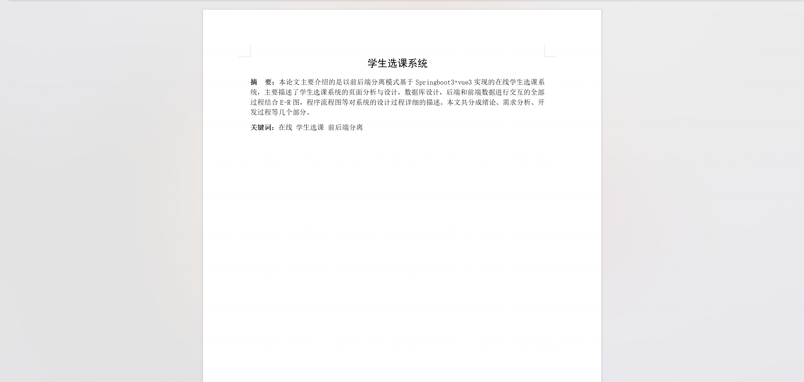
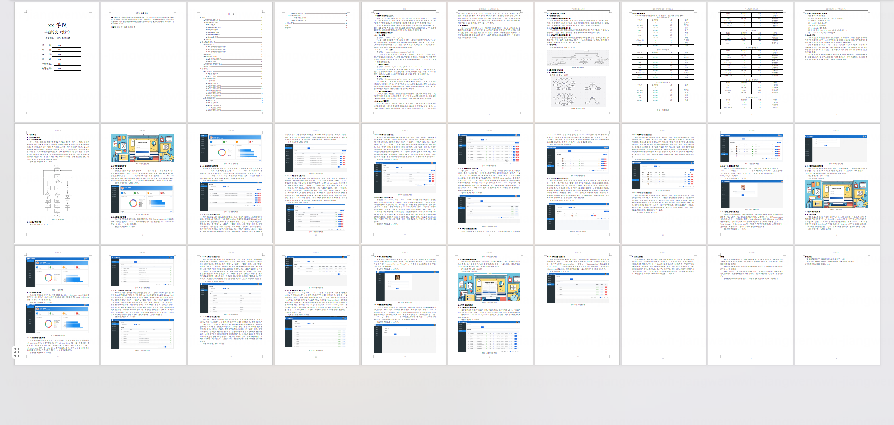
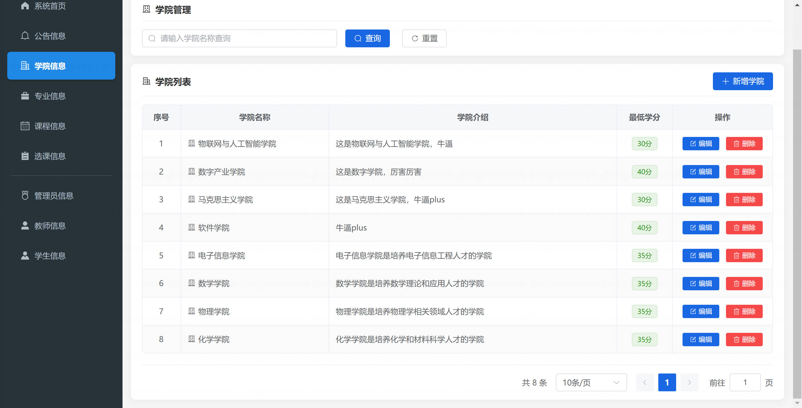
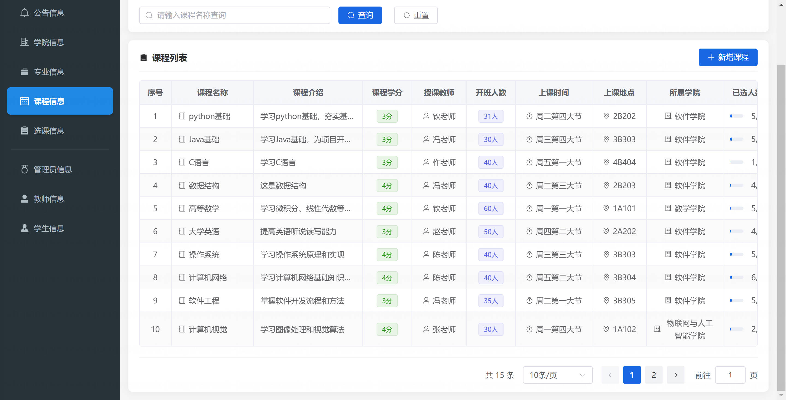
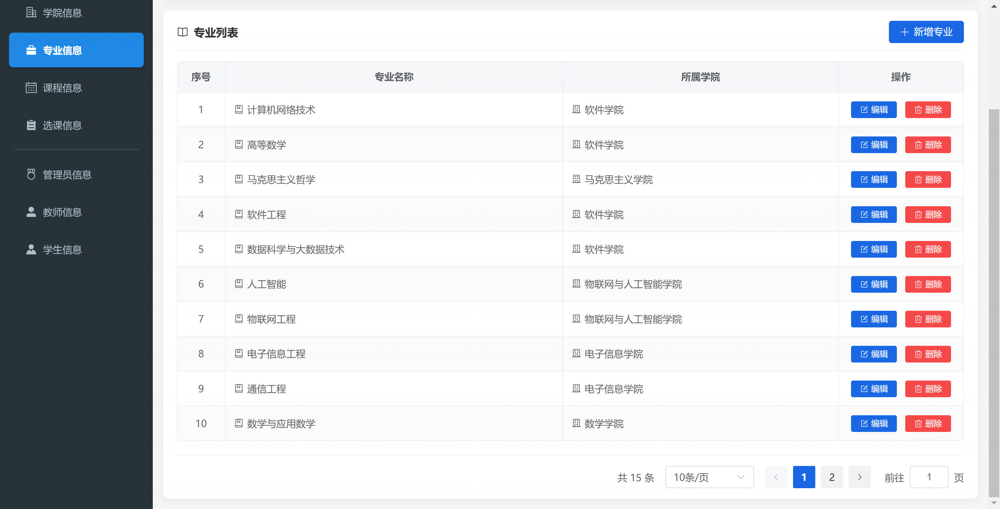
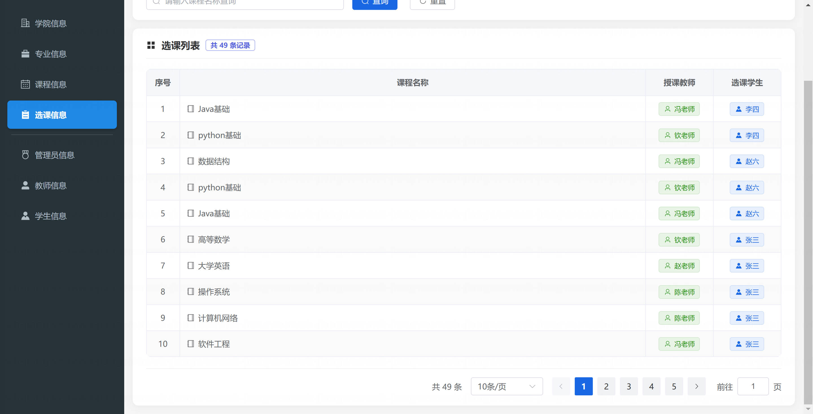
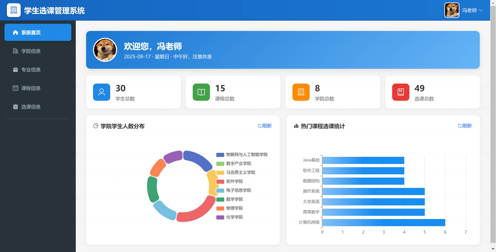
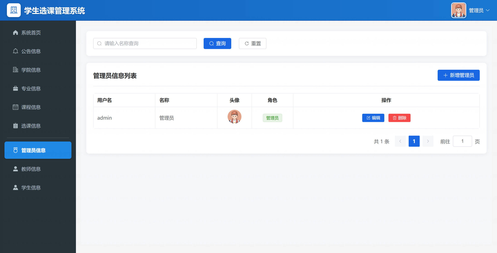

<h1 align="center">基于SpringBoot的学生选课管理系统【带论文】</h1>

- <b>完整代码获取地址：从戎源码网 ([https://armycodes.com/](https://armycodes.com/))</b>
- <b>技术探讨、资料分享，请加QQ群：692619798</b>
- <b>作者微信：19941326836  QQ：3645296857</b>
- <b>承接计算机毕业设计、Java毕业设计、Python毕业设计、深度学习、机器学习</b>
- <b>选题+开题报告+任务书+程序定制+安装调试+论文+答辩ppt 一条龙服务</b>
- <b>所有选题地址 ([https://github.com/Descartes007/allProject](https://github.com/Descartes007/allProject)) </b>

## 一、项目介绍

基于SpringBoot的学生选课管理系统，系统角色为 管理员（ADMIN）、教师（TEACHER）、学生（STUDENT），主要功能如下：
### 管理员（ADMIN）
- 基本操作：登录、修改密码、获取/修改个人信息
- 用户管理：增删改查管理员/教师/学生信息、分页和条件查询
- 课程管理：新增/修改/删除课程、分页/查询课程列表
- 学院/专业管理：新增/修改/删除/查询（分页）
- 公告管理：发布/编辑/删除/查询公告（分页）
- 选课管理：查看/删除选课记录、统计报表
- 文件管理：管理上传文件与下载链接
- 统计报表：学生/课程/学院/选课 等聚合统计（用于仪表盘）
### 教师（TEACHER）
- 基本操作：登录、修改密码、获取/修改个人信息
- 课程与选课查看：查看自己授课或课程的选课情况
- 公告查看/发布（视权限而定）
- 学生信息查看与管理（视权限而定）
### 学生（STUDENT）
- 基本操作：登录、注册、修改密码、获取/修改个人信息
- 选课：选课/退选、查看自己的选课记录
- 课程查看：查看课程列表、详情、按条件分页查询

## 二、项目技术

- 开发语言：Java 21
- 项目架构：B/S 架构（前后端分离）
- 后端框架：Spring Boot 3.3.1，MyBatis，MySQL，PageHelper，Hutool，JdbcTemplate
- 前端框架：Vue 3 + Vite，Vue Router，Element Plus，Axios，ECharts

## 三、运行环境

- JDK版本：17
- 操作系统：Windows7/10、MacOS
- 开发工具：IDEA、Ecplise、MyEclipse都可以

## 四、数据库配置文件

- npm版本：6.14.13及以上都可以
- Redis版本：3.2.100及以上都可以
- 文件名：application.yml
- 编码类型：utf8

## 论文截图

## 系统截图

